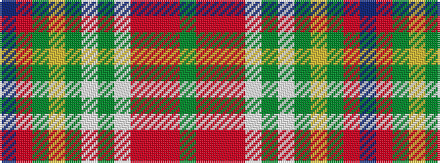

BRGYGWGWRRRG

It is a 12 stripe tartan.

<figure class="pat-woven">

<figcaption>idealised sample</figcaption>
</figure>

## Colour Sequence



## Tartans with this colour sequence

| Tartans |
|---------------|
| [MacLean of Duart Dress](/setts/s12/n12o2dy4lo2dy3w3dy3w19r30o2r4dy2~x2/)|
||
