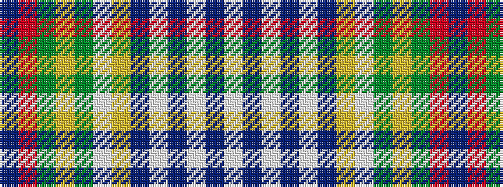

BRGYGWYBWBWBW

It is a 13 stripe tartan.

<figure class="pat-woven">

<figcaption>idealised sample</figcaption>
</figure>

## Colour Sequence



## Tartans with this colour sequence

| Tartans |
|---------------|
| [Saint Joseph de Sorel #2](/variants/s13/t8r12g2lo5g2lb9ly3t8w1t3w1t3w1~x4/)|
||
