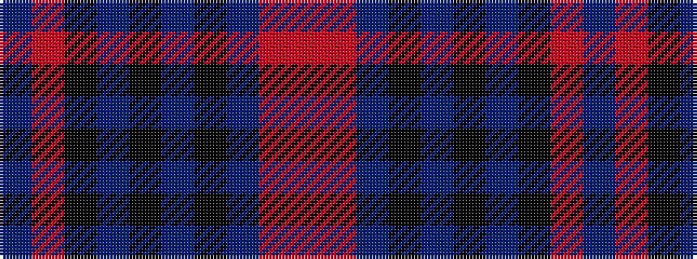

BRKBKBKBRR

It is a 10 stripe tartan.

<figure class="pat-woven">

<figcaption>idealised sample</figcaption>
</figure>

## Colour Sequence



## Tartans with this colour sequence

| Tartans |
|---------------|
| [The KpgM](/variants/s10/r24o4db6k6db60k40dr12k20o3dr8/)|
||
