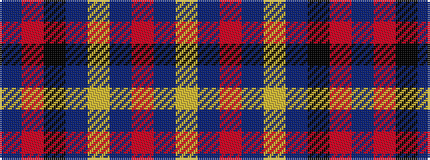

BRKBYBRBY

It is a 9 stripe tartan.

<figure class="pat-woven">

<figcaption>idealised sample</figcaption>
</figure>

## Colour Sequence



## Tartans with this colour sequence

| Tartans |
|---------------|
| [Greater St Louis Area Firefighters Highland Guard](/setts/s9/n3r3k38n25ly3n6r7n3ly2~x2/)|
||
