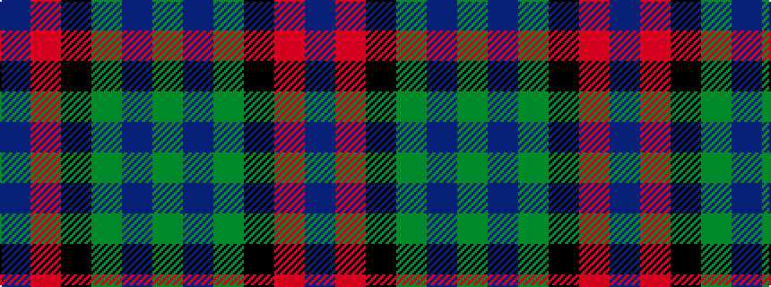

BRKGBG

It is a 6 stripe tartan.

<figure class="pat-woven">

<figcaption>idealised sample</figcaption>
</figure>

## Colour Sequence



## Tartans with this colour sequence

| Tartans |
|---------------|
| [Edinburgh International Conference Centre, The](/variants/s6/dy4dt20dy3k20o24dt3~x2/)|
||
