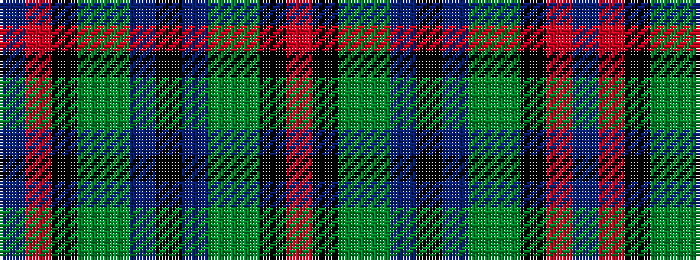

BRKGGBKBGGKR

It is a 12 stripe tartan.

<figure class="pat-woven">

<figcaption>idealised sample</figcaption>
</figure>

## Colour Sequence



## Tartans with this colour sequence

| Tartans |
|---------------|
| [Swankie (Personal)](/setts/s12/r6k20y4dy10b21k4b21dy10y4k20r6b3~x2/)|
||
