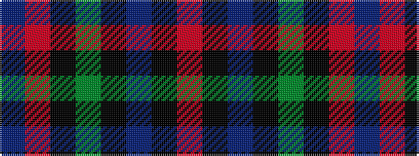

BRKGKBKR

It is a 8 stripe tartan.

<figure class="pat-woven">

<figcaption>idealised sample</figcaption>
</figure>

## Colour Sequence



## Tartans with this colour sequence

| Tartans |
|---------------|
| [Common Kilt](/variants/s8/r3k2db25k28dg25k2r1db2~x2/)|
||
| [Common Kilt](/variants/s8/r3k2db25k28g25k2r1db2~x2/)|
||
