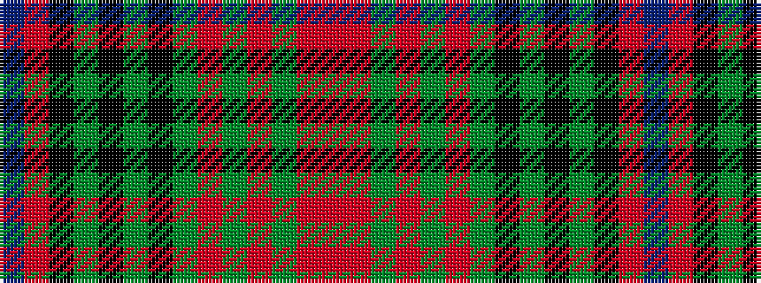

BRKGKGKGRGRGRR

It is a 14 stripe tartan.

<figure class="pat-woven">

<figcaption>idealised sample</figcaption>
</figure>

## Colour Sequence



## Tartans with this colour sequence

| Tartans |
|---------------|
| [Berwick -upon-Tweed (asymmetric)](/variants/s14/r16o5dg2o4dg2o5y38k5dg2k4dg2k5r8b4~x2/)|
||
