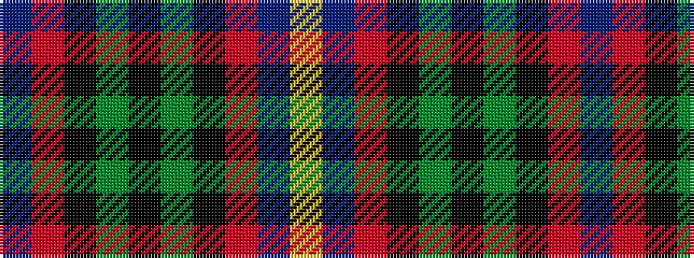

BRKGKGKRBY

It is a 10 stripe tartan.

<figure class="pat-woven">

<figcaption>idealised sample</figcaption>
</figure>

## Colour Sequence



## Tartans with this colour sequence

| Tartans |
|---------------|
| [Mitchell](/setts/s10/db17r2k16g17k2g17k16r2db17lr2~x2/)|
||
