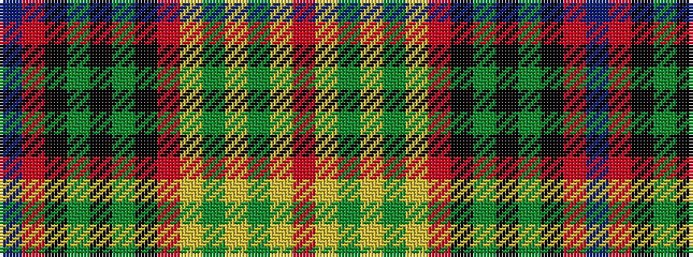

BRKGKGKRYGYGYR

It is a 14 stripe tartan.

<figure class="pat-woven">

<figcaption>idealised sample</figcaption>
</figure>

## Colour Sequence



## Tartans with this colour sequence

| Tartans |
|---------------|
| [Berwick District Tartan](/variants/s14/r8lo5g2lo4g2lo5o38k5g2k4g2k5r8t4~x2/)|
||
