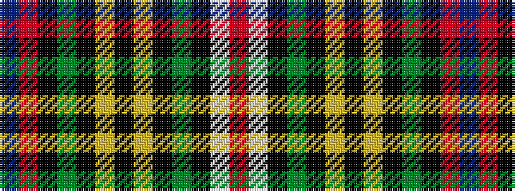

BRKGKYKYKGKWR

It is a 13 stripe tartan.

<figure class="pat-woven">

<figcaption>idealised sample</figcaption>
</figure>

## Colour Sequence



## Tartans with this colour sequence

| Tartans |
|---------------|
| [Buchanan, dress](/setts/s13/r3w34k2y4k2ly7k2ly7k2y4k2o34t3~x2/)|
||
