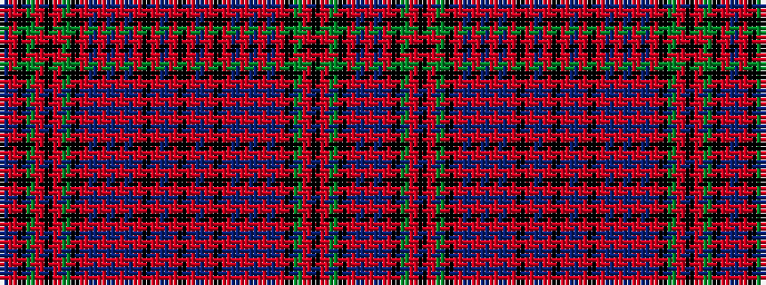

BRKGRKRGKRBRBRBRKRBRKRBRKRBRBRBRKGRKRGKRBR

It is a 42 stripe tartan.

<figure class="pat-woven">

<figcaption>idealised sample</figcaption>
</figure>

## Colour Sequence



## Tartans with this colour sequence

| Tartans |
|---------------|
| [Unidentified Cant #06](/setts/s42/r16t3r16k3dg32r16k3r16dg32k3r18db3r3t3r3db3r18k34r3db34r16k3/)|
||
