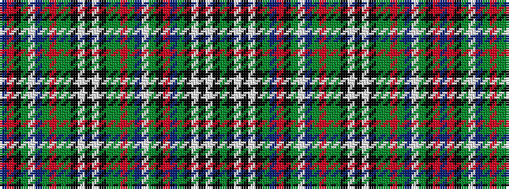

BRKGWBGRGGKWKWKGGRGBWGKRBGKWKWKG

It is a 32 stripe tartan.

<figure class="pat-woven">

<figcaption>idealised sample</figcaption>
</figure>

## Colour Sequence



## Tartans with this colour sequence

| Tartans |
|---------------|
| [Special 1](/variants/s32/y18k3w4k3w4k3y18b1o18k1g18w1b18y1o18g1y18k3w4k3w4k3y18g1o18y1b18w1g18k1o18b1~x2/)|
||
