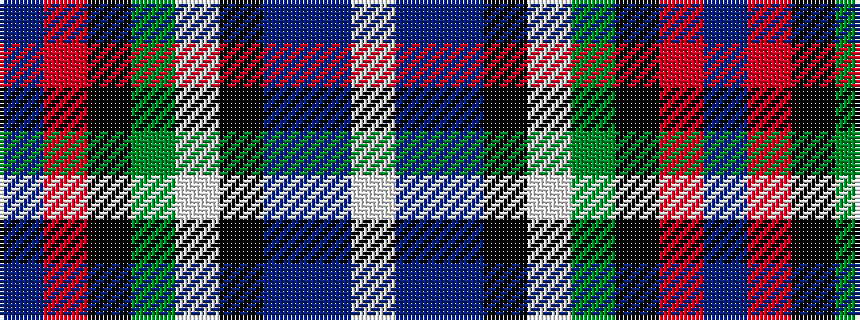

BRKGWKBBW

It is a 9 stripe tartan.

<figure class="pat-woven">

<figcaption>idealised sample</figcaption>
</figure>

## Colour Sequence



## Tartans with this colour sequence

| Tartans |
|---------------|
| [Moran (Virgin Islands) (Personal)](/setts/s9/t3r3k5g8w2k13db13t26w3~x2/)|
||
