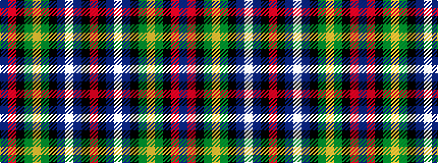

BRKGYGKBWBKR

It is a 12 stripe tartan.

<figure class="pat-woven">

<figcaption>idealised sample</figcaption>
</figure>

## Colour Sequence



## Tartans with this colour sequence

| Tartans |
|---------------|
| [Rust](/variants/s12/r3k2p12w2p12k12g12ly2g12k2r1b2~x2/)|
||
| [Rust (Personal)](/variants/s12/r3k2dp12w2dp12k12g12lo2g12k2r1db2~x2/)|
||
| [Rust Personal Tartan](/variants/s12/r3k2dp12w2dp12k12g12ly2g12k2r1t2~x2/)|
||
