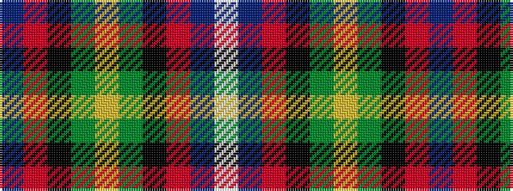

BRKGYGKRBW

It is a 10 stripe tartan.

<figure class="pat-woven">

<figcaption>idealised sample</figcaption>
</figure>

## Colour Sequence



## Tartans with this colour sequence

| Tartans |
|---------------|
| [Unidentified Scarlett #7](/variants/s10/dp22r3k22g22ly2g22k22r3dp22w3~x2/)|
||
