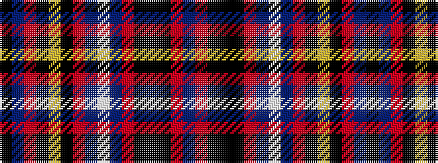

BRKKKRBWBRKYKRBK

It is a 16 stripe tartan.

<figure class="pat-woven">

<figcaption>idealised sample</figcaption>
</figure>

## Colour Sequence



## Tartans with this colour sequence

| Tartans |
|---------------|
| [Amnesty International Corporate Tartan Tartan Number: 3016. Earliest known date: 2002 Bill Scobie of Amnesty International Dumbarton and Lomond Group in Scotland, asked James Scarlett to design a celebratory tartan for their 40th year. The colours describe the multi-racial and international compass of AI's work. See products available Copyright © Blair Urquhart, Comrie, 2015](/setts/s16/db6o4k6k1k6o4db6w1db6o4k6ly1k6o4db6ki1~x4/)|
||
