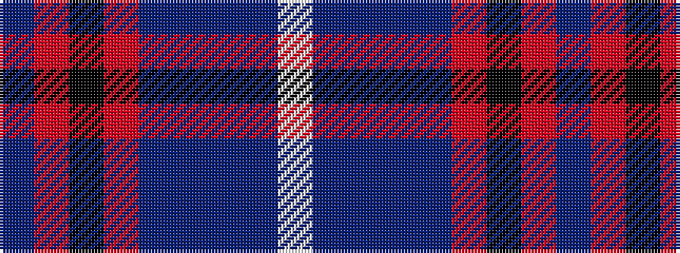

BRKRBBBBW

It is a 9 stripe tartan.

<figure class="pat-woven">

<figcaption>idealised sample</figcaption>
</figure>

## Colour Sequence



## Tartans with this colour sequence

| Tartans |
|---------------|
| [Japan–Scotland Society, The](/setts/s9/dbi12r1k4r2dbi10db20dbii3db9w1~x2/)|
||
