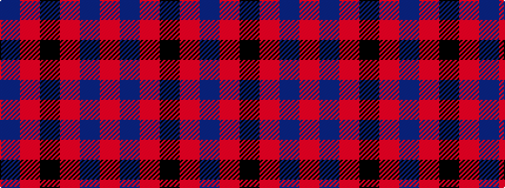

BRKRBR

It is a 6 stripe tartan.

<figure class="pat-woven">

<figcaption>idealised sample</figcaption>
</figure>

## Colour Sequence



## Tartans with this colour sequence

| Tartans |
|---------------|
| [Edinburgh International Conference Centre](/variants/s6/oi4db19oi3k20o24db3~x2/)|
||
| [Williamson (Personal)](/variants/s6/r7db20r4k18o20dp5~x2/)|
||
