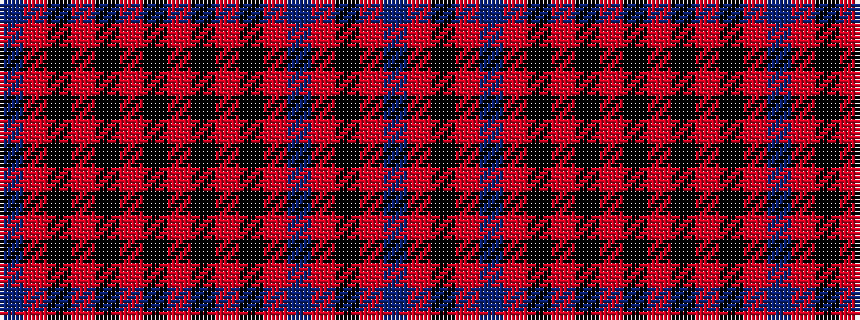

BRKRBRKRKRKRKRKRB

It is a 17 stripe tartan.

<figure class="pat-woven">

<figcaption>idealised sample</figcaption>
</figure>

## Colour Sequence



## Tartans with this colour sequence

| Tartans |
|---------------|
| [Mary Stuart (Fashion?](/setts/s17/db4r1k1r1k4r1k1r1k4r1k1r1db4r1k1r1db4~x4/)|
||
