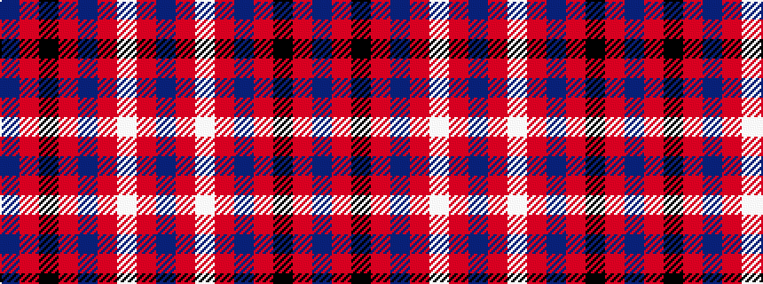

BRKRBRWRB

It is a 9 stripe tartan.

<figure class="pat-woven">

<figcaption>idealised sample</figcaption>
</figure>

## Colour Sequence



## Tartans with this colour sequence

| Tartans |
|---------------|
| [MacPherson](/setts/db1r1k8r1db1r1w8r1db1/)|
||
| [Meg Merrilees, New (1831)](/variants/s9/t5r5k58r5t5r5w25r5t4/)|
||
