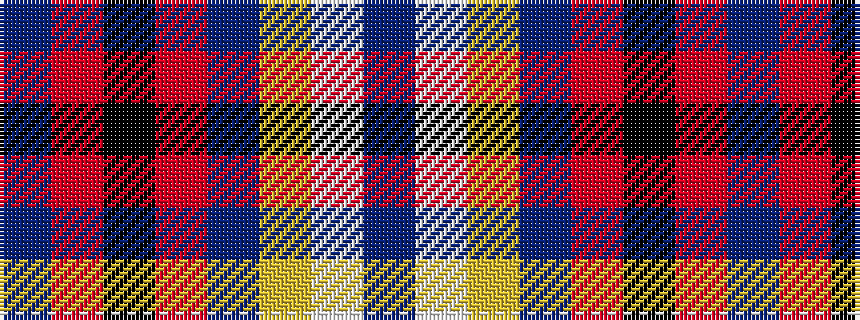

BRKRBYWB

It is a 8 stripe tartan.

<figure class="pat-woven">

<figcaption>idealised sample</figcaption>
</figure>

## Colour Sequence



## Tartans with this colour sequence

| Tartans |
|---------------|
| [Unidentified, Lady's kilt](/setts/s8/db39o3k14o3t14ly4w2dr2~x2/)|
||
