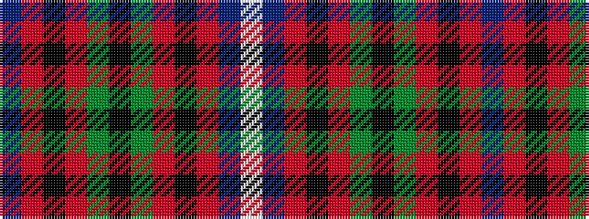

BRKRGKGRKRBW

It is a 12 stripe tartan.

<figure class="pat-woven">

<figcaption>idealised sample</figcaption>
</figure>

## Colour Sequence



## Tartans with this colour sequence

| Tartans |
|---------------|
| [Souza Nery (Personal)](/variants/s12/db37r3ki17r3g22k4g22r3ki17r3db37w3~x2/)|
||
