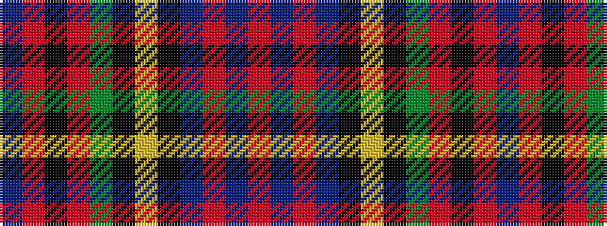

BRKRGKYKBRBR

It is a 12 stripe tartan.

<figure class="pat-woven">

<figcaption>idealised sample</figcaption>
</figure>

## Colour Sequence



## Tartans with this colour sequence

| Tartans |
|---------------|
| [Unidentified pattern](/variants/s12/db2r4k7r8dg10k4ly2k8db4r4db14r2~x2/)|
||
| [Unidentified, pattern](/variants/s12/db2r4k7r8g10k4ly2k8db4r4db14r2~x2/)|
||
