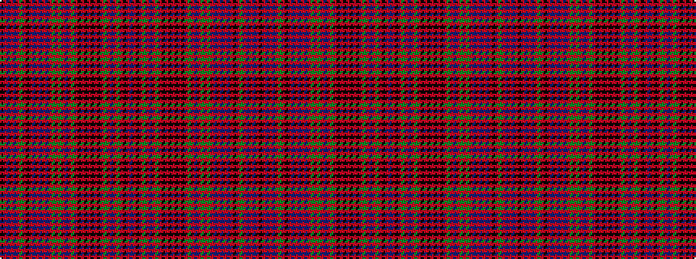

BRKRGRBRGRKRKRKRKRGRBRGRGRBRBRBRKRGRBRBRK

It is a 41 stripe tartan.

<figure class="pat-woven">

<figcaption>idealised sample</figcaption>
</figure>

## Colour Sequence



## Tartans with this colour sequence

| Tartans |
|---------------|
| [MacKintosh #6](/variants/s41/db48r40k4r4dgi48r54db46r54dg14r4k4r4k4r48k4r4k4r4dg14r52db46r54dg60r4dg4r48db4r12db4r4db4r48k4r4dg60r48db4r4db4r4k7/)|
||
