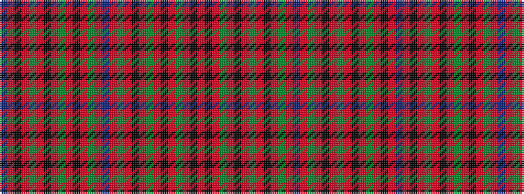

BRKRGRKRGRKRGRBRGRKRGRKRGRKR

It is a 28 stripe tartan.

<figure class="pat-woven">

<figcaption>idealised sample</figcaption>
</figure>

## Colour Sequence



## Tartans with this colour sequence

| Tartans |
|---------------|
| [Kilbarchan Unidentified No. 7](/setts/s28/r4k4r6g24r4k3r6g3r4k24r6g4r4t4r4g4r6k24r4g3r6k3r4g24r6k4r4t4~x2/)|
||
