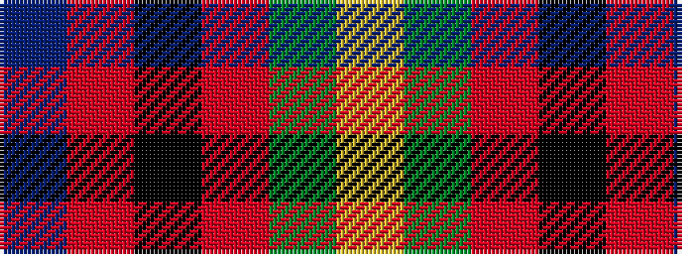

BRKRGY

It is a 6 stripe tartan.

<figure class="pat-woven">

<figcaption>idealised sample</figcaption>
</figure>

## Colour Sequence



## Tartans with this colour sequence

| Tartans |
|---------------|
| [Royal College of Physicians (Corp)](/variants/s6/db18r3k9r3g23ly3~x2/)|
||
| [Royal College of Physicians of Edinburgh](/variants/s6/db28r4k14r4dg33ly4~x2/)|
||
