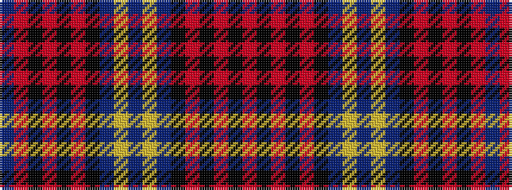

BRKRKRKBYBYBKRKRKR

It is a 18 stripe tartan.

<figure class="pat-woven">

<figcaption>idealised sample</figcaption>
</figure>

## Colour Sequence



## Tartans with this colour sequence

| Tartans |
|---------------|
| [Highland Granite Weavers Tartan](/variants/s18/o16k2o3k2o4k10n27lr2n8lr2n27k10o4k2o3k2o16n2~x2/)|
||
