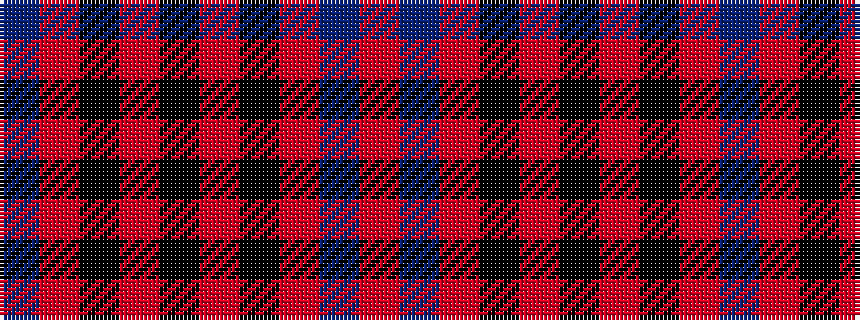

BRKRKRKRBR

It is a 10 stripe tartan.

<figure class="pat-woven">

<figcaption>idealised sample</figcaption>
</figure>

## Colour Sequence



## Tartans with this colour sequence

| Tartans |
|---------------|
| [Masai Shuka 27 (Artefact)](/setts/s10/r30db8r2k1r2k1~x2/)|
||
