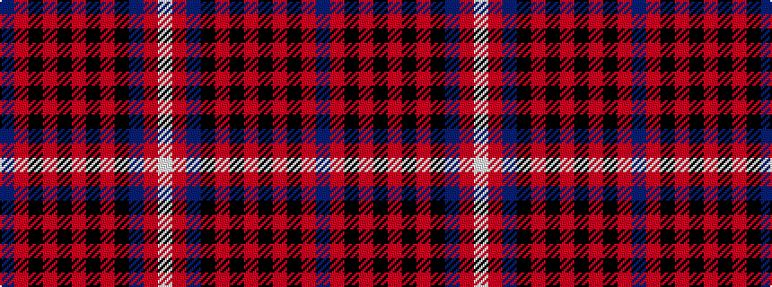

BRKRKRKRKBRW

It is a 12 stripe tartan.

<figure class="pat-woven">

<figcaption>idealised sample</figcaption>
</figure>

## Colour Sequence



## Tartans with this colour sequence

| Tartans |
|---------------|
| [MacKinnon Black (Personal)](/variants/s12/dp3r4k5r12k24r3k10r26k12dp3r6w3~x2/)|
||
