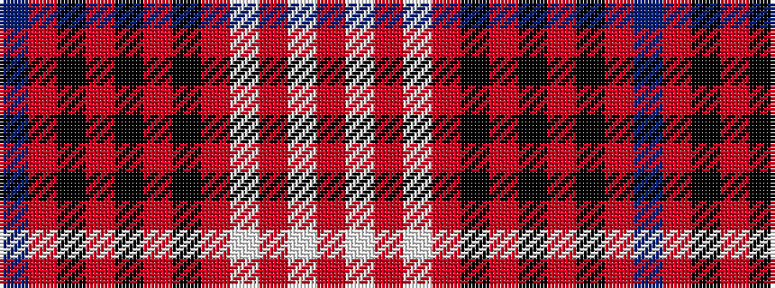

BRKRKRKRWRWR

It is a 12 stripe tartan.

<figure class="pat-woven">

<figcaption>idealised sample</figcaption>
</figure>

## Colour Sequence



## Tartans with this colour sequence

| Tartans |
|---------------|
| [Eidart 1990 (Fashion)](/setts/s12/n4r20k2r2k2r3k6o26w3o2w2o4~x2/)|
||
