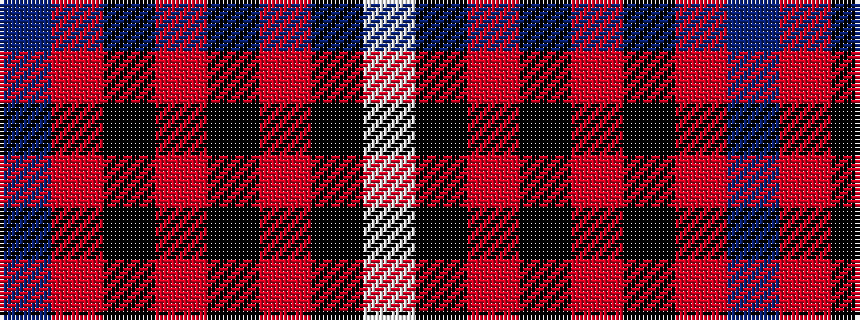

BRKRKRKW

It is a 8 stripe tartan.

<figure class="pat-woven">

<figcaption>idealised sample</figcaption>
</figure>

## Colour Sequence



## Tartans with this colour sequence

| Tartans |
|---------------|
| [Nakayama (Fashion)](/setts/s8/b1r1k2r7k7r1k2w1~x6/)|
||
| [Nakayama (Personal)](/setts/s8/db1r1k2r7k7r1k2w1~x6/)|
||
