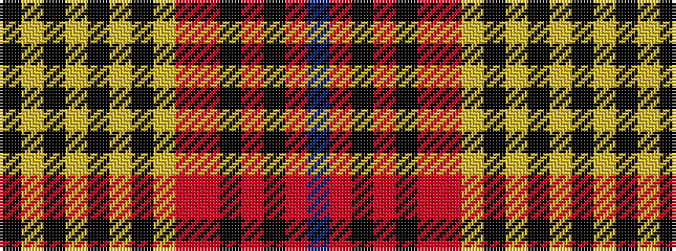

BRKRKRRYKYKYKYK

It is a 15 stripe tartan.

<figure class="pat-woven">

<figcaption>idealised sample</figcaption>
</figure>

## Colour Sequence



## Tartans with this colour sequence

| Tartans |
|---------------|
| [Caithness (District)](/setts/s15/do28r3k2o2k2r3o8lo2k8lo5k3ly2k2lo3k1~x2/)|
||
