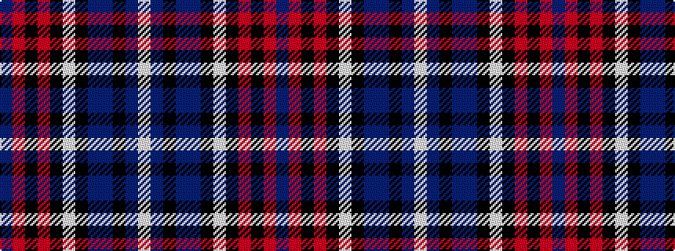

BRKRKWKBBKBW

It is a 12 stripe tartan.

<figure class="pat-woven">

<figcaption>idealised sample</figcaption>
</figure>

## Colour Sequence



## Tartans with this colour sequence

| Tartans |
|---------------|
| [British Caledonian Airways #3](/variants/s12/db68o5k9o3k3lb3k3n20db9k3db5lb4/)|
||
