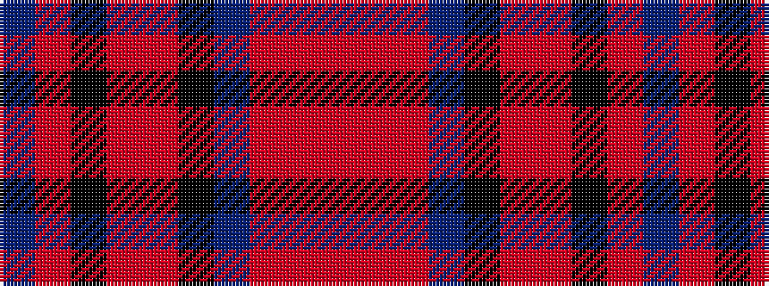

BRKRRKBRRR

It is a 10 stripe tartan.

<figure class="pat-woven">

<figcaption>idealised sample</figcaption>
</figure>

## Colour Sequence



## Tartans with this colour sequence

| Tartans |
|---------------|
| [Dobrain (Personal)](/variants/s10/r24o2r4n2k6o2r14k3o4n8~x2/)|
||
