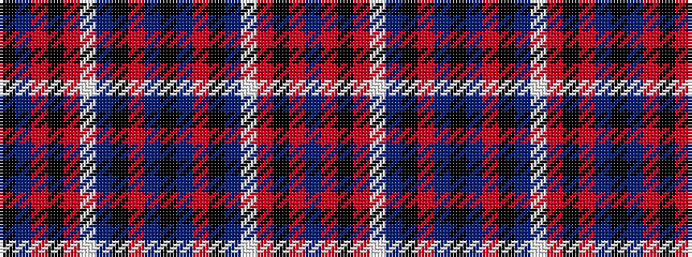

BRKRWBKRBKBRKBWRKRBK

It is a 20 stripe tartan.

<figure class="pat-woven">

<figcaption>idealised sample</figcaption>
</figure>

## Colour Sequence



## Tartans with this colour sequence

| Tartans |
|---------------|
| [Iron Horse (Corporate)](/setts/s20/k16n4o3k2db1w1r1k2o3n4k12~x4/)|
||
