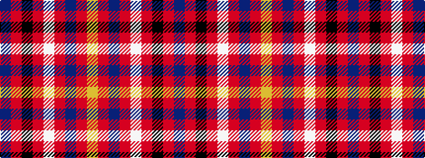

BRKRWRBRY

It is a 9 stripe tartan.

<figure class="pat-woven">

<figcaption>idealised sample</figcaption>
</figure>

## Colour Sequence



## Tartans with this colour sequence

| Tartans |
|---------------|
| [Ulster Ancestry](/variants/s9/do47r8k22r7w3r24do9r10ly3~x2/)|
||
| [Ulster Ancestry (Fashion)](/variants/s9/n47r8k22r7lb3r24n9r10lo3~x2/)|
||
