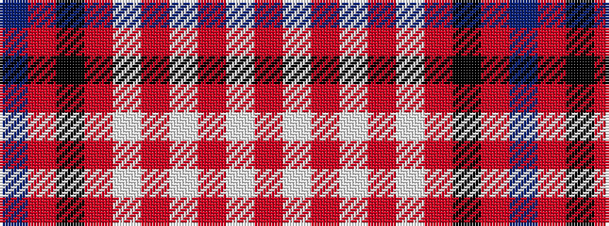

BRKRWRWRWR

It is a 10 stripe tartan.

<figure class="pat-woven">

<figcaption>idealised sample</figcaption>
</figure>

## Colour Sequence



## Tartans with this colour sequence

| Tartans |
|---------------|
| [Good Conduct (USA)](/variants/s10/db5r12k38r4w2r2w2r2w2r4~x2/)|
||
