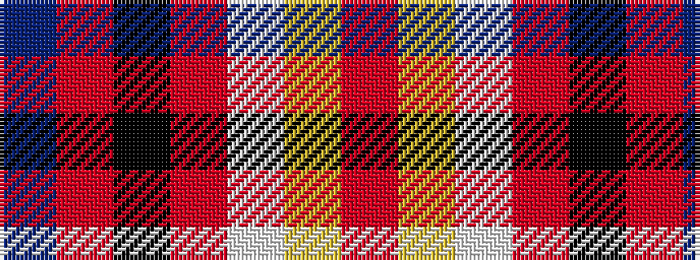

BRKRWYR

It is a 7 stripe tartan.

<figure class="pat-woven">

<figcaption>idealised sample</figcaption>
</figure>

## Colour Sequence



## Tartans with this colour sequence

| Tartans |
|---------------|
| [Java Saint Andrew Society Dress](/setts/s7/dt50r26k9r4w2lo2r10~x2/)|
||
