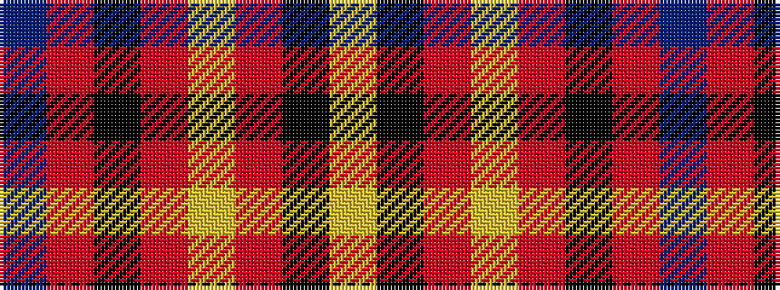

BRKRYRKY

It is a 8 stripe tartan.

<figure class="pat-woven">

<figcaption>idealised sample</figcaption>
</figure>

## Colour Sequence



## Tartans with this colour sequence

| Tartans |
|---------------|
| [degli Uberti, Baron of Cartsburn (Personal)](/variants/s8/db8r1k6r1lo8r1k45lo1~x2/)|
||
