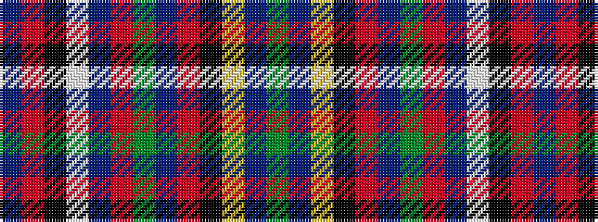

BRKWBRGBRKYBG

It is a 13 stripe tartan.

<figure class="pat-woven">

<figcaption>idealised sample</figcaption>
</figure>

## Colour Sequence



## Tartans with this colour sequence

| Tartans |
|---------------|
| [Wcwm 1571](/variants/s13/db64r3k3lb2db3r28dg26db3r3k3ly2db3dg16~x2/)|
||
