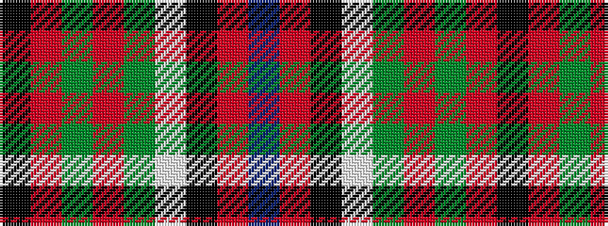

BRKWGRGRK

It is a 9 stripe tartan.

<figure class="pat-woven">

<figcaption>idealised sample</figcaption>
</figure>

## Colour Sequence



## Tartans with this colour sequence

| Tartans |
|---------------|
| [United Arrows House Check](/setts/s9/db40r4k16w3dy8ri4dy3ri8k10~x2/)|
||
