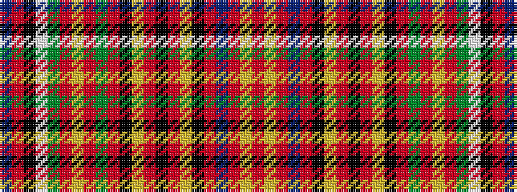

BRKWGRYRGRKYRKRYKRBRYR

It is a 22 stripe tartan.

<figure class="pat-woven">

<figcaption>idealised sample</figcaption>
</figure>

## Colour Sequence



## Tartans with this colour sequence

| Tartans |
|---------------|
| [Hay or Leith](/setts/s22/db41r2k42w2dg41r3ly2r3dg3r31k3ly2r3k5r3ly2k3r31db3r3ly2r3~x2/)|
||
| [Hay, or Leith](/setts/s22/db41r2k42w2g41r3ly2r3g3r31k3ly2r3k5r3ly2k3r31db3r3ly2r3~x2/)|
||
