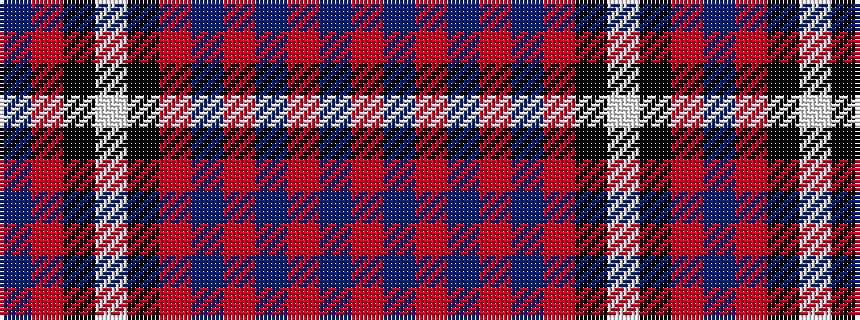

BRKWKRBRBRBR

It is a 12 stripe tartan.

<figure class="pat-woven">

<figcaption>idealised sample</figcaption>
</figure>

## Colour Sequence



## Tartans with this colour sequence

| Tartans |
|---------------|
| [Rosie (Personal)](/setts/s12/dt30r3k2lb2k2r3dt24ri2dt2ri2dt2ri6~x2/)|
||
