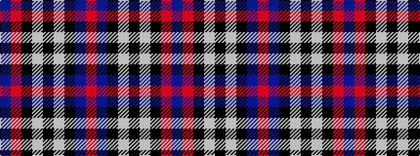

BRKWKWKBR

It is a 9 stripe tartan.

<figure class="pat-woven">

<figcaption>idealised sample</figcaption>
</figure>

## Colour Sequence



## Tartans with this colour sequence

| Tartans |
|---------------|
| [Scottish Knights Templar Int. (Corp)](/variants/s9/r3db20k6lb5k4lb3k2r1db2~x2/)|
||
| [Scottish Knights Templar, of M.T.S. International](/variants/s9/r3db20k6w5k4w3k2r1db2~x2/)|
||
