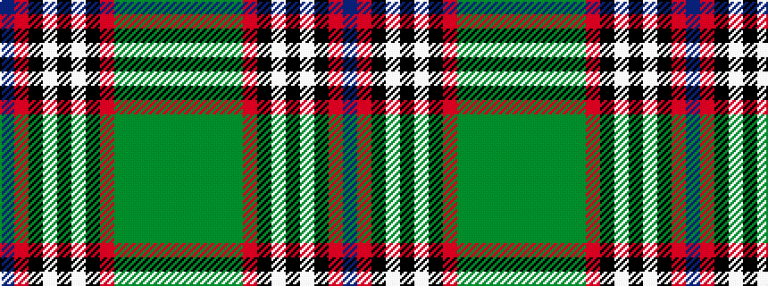

BRKWKWKRGGGGG

It is a 13 stripe tartan.

<figure class="pat-woven">

<figcaption>idealised sample</figcaption>
</figure>

## Colour Sequence



## Tartans with this colour sequence

| Tartans |
|---------------|
| [Carson of Rusco (Personal)](/variants/s13/dt36m2k3lb2k8lb2k3m2dg11g6dg4g4dg20~x2/)|
||
