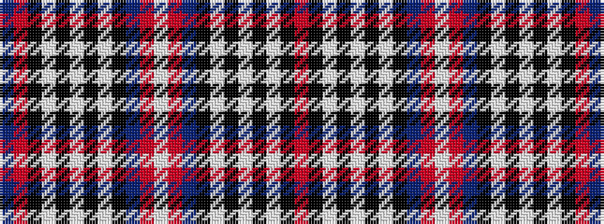

BRKWKWKWKBRWRBKWKWKWKR

It is a 22 stripe tartan.

<figure class="pat-woven">

<figcaption>idealised sample</figcaption>
</figure>

## Colour Sequence



## Tartans with this colour sequence

| Tartans |
|---------------|
| [Scottish Knights Templar St. Andrews](/setts/s22/lb4r1db20k6lb5k4lb4k4lb3k2r1db2~x2/)|
||
