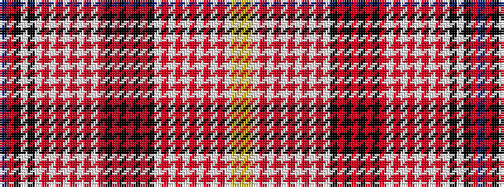

BRKWKWRWRWRWRWRKRKRKRKWRWRWRWRWRWYY

It is a 35 stripe tartan.

<figure class="pat-woven">

<figcaption>idealised sample</figcaption>
</figure>

## Colour Sequence



## Tartans with this colour sequence

| Tartans |
|---------------|
| [All breeds Dairy Goats (Version 2)](/variants/s35/db10r10k16w4k16w1o1w1o1w1o1w1o1w1o1k1o1k1o1k1o1k1w1o1w1o1w1o1w1o1w1o22w24lg10ly10~x2/)|
||
