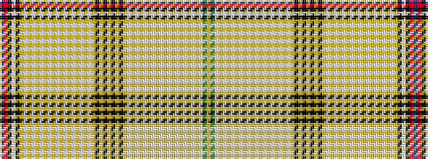

BRKWKYWYWYWYWYWYWYWYWYWYKYKYKYKYWYWYWYWYWYWYWYWYWYWGY

It is a 53 stripe tartan.

<figure class="pat-woven">

<figcaption>idealised sample</figcaption>
</figure>

## Colour Sequence



## Tartans with this colour sequence

| Tartans |
|---------------|
| [All Breeds Dairy Goats #2 (Corp)](/variants/s53/db10r10k16w4k16lo1w1lo1w1lo1w1lo1w1lo1w1lo1w1lo1w1lo1w1lo1w1lo1k1lo1k1lo1k1lo1k1lo1w1lo1w1lo1w1lo1w1lo1w1lo1w1lo1w1lo1w1lo1w1lo22w24g10ly10~x2/)|
||
