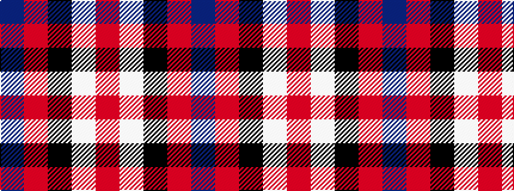

BRKWR

It is a 5 stripe tartan.

<figure class="pat-woven">

<figcaption>idealised sample</figcaption>
</figure>

## Colour Sequence



## Tartans with this colour sequence

| Tartans |
|---------------|
| [Christie (2016)](/variants/s5/b16r1k16w1r1~x4/)|
||
